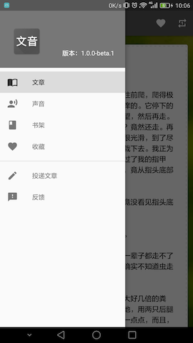
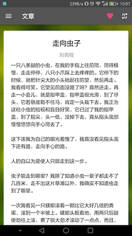
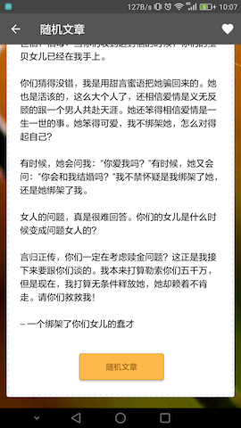
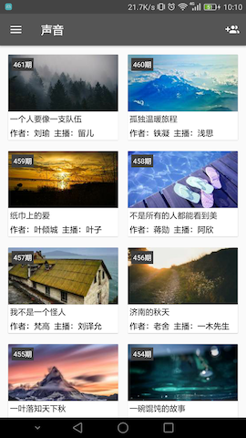
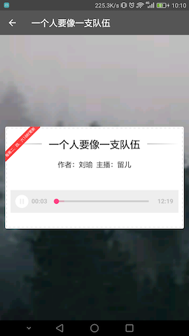
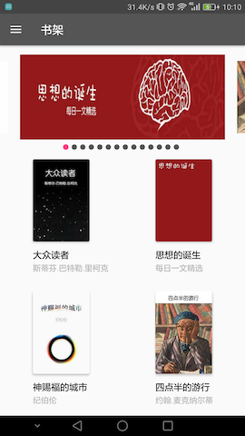
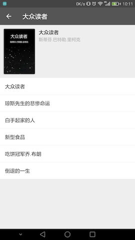
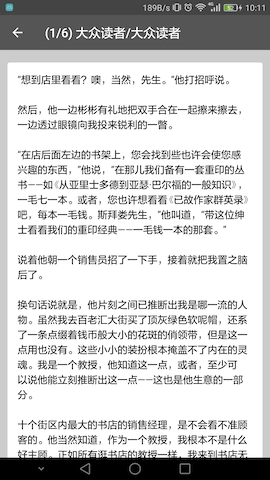
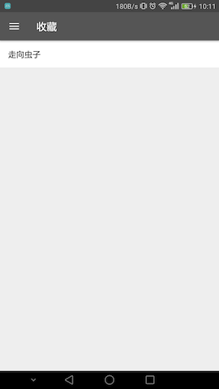
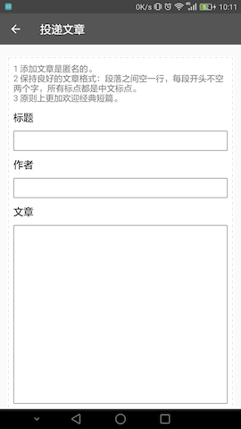

# 文音悦读

[每日一文](https://meiriyiwen.com/) 非官方 Android APP

采用 Kotlin 语言编写，配合 MVP 模式探索。

用到的第三方框架主要有：

- RxJava
- RxAndroid
- RxBinding 系列
- RxLifecycle
- Dagger 2
- AutoValue 系列
- Jsoup
- ExoPlayer
- SQLDelight
- Retrofit 2
- OkHttp 3
- Picasso

## Screenshots

## TODOs

- [ ] 夜间模式
- [ ] 音乐文件本地缓存

## License

Copyright 2017 Grubber

Licensed under the Apache License, Version 2.0 (the "License");
you may not use this file except in compliance with the License.
You may obtain a copy of the License at

   http://www.apache.org/licenses/LICENSE-2.0

Unless required by applicable law or agreed to in writing, software
distributed under the License is distributed on an "AS IS" BASIS,
WITHOUT WARRANTIES OR CONDITIONS OF ANY KIND, either express or implied.
See the License for the specific language governing permissions and
limitations under the License.